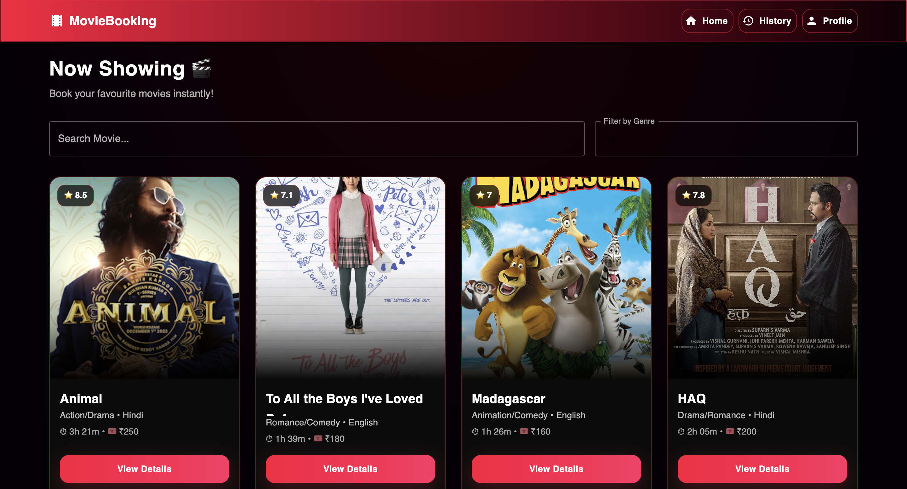
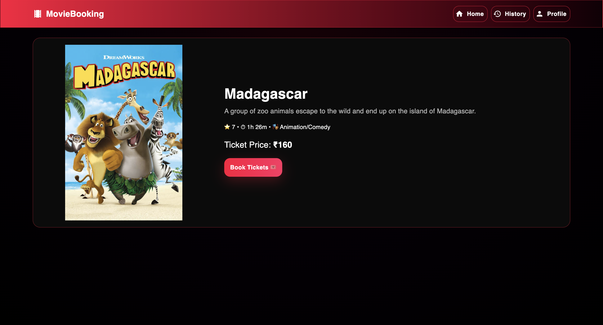
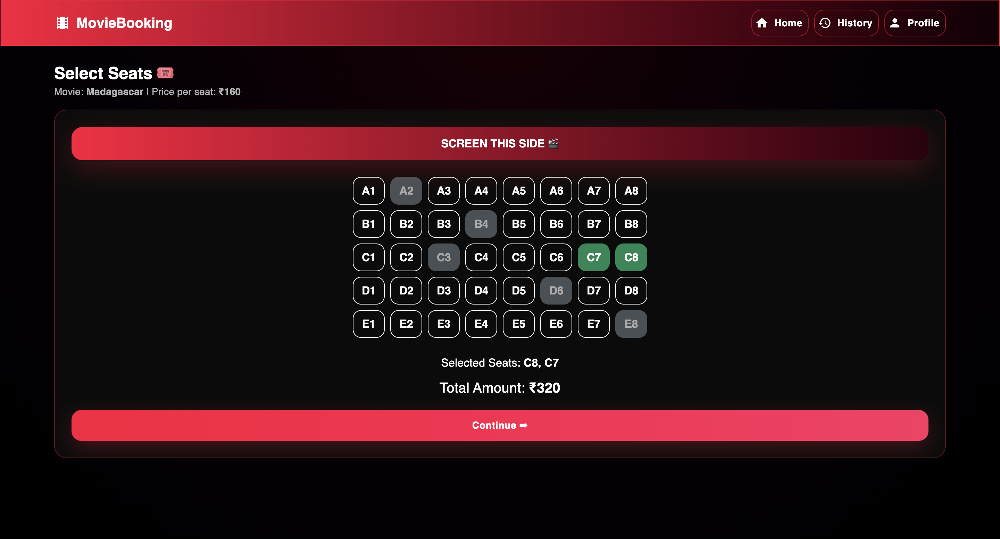
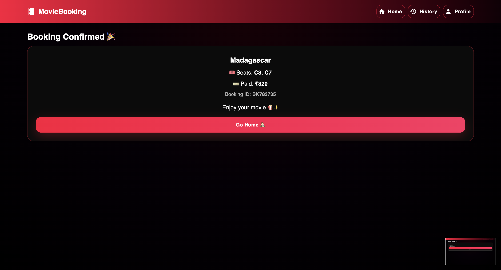
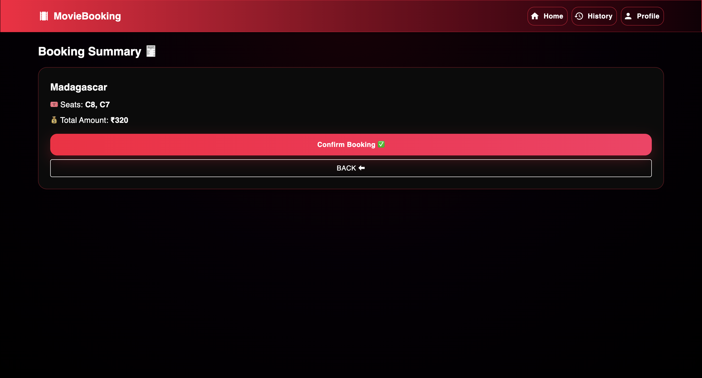
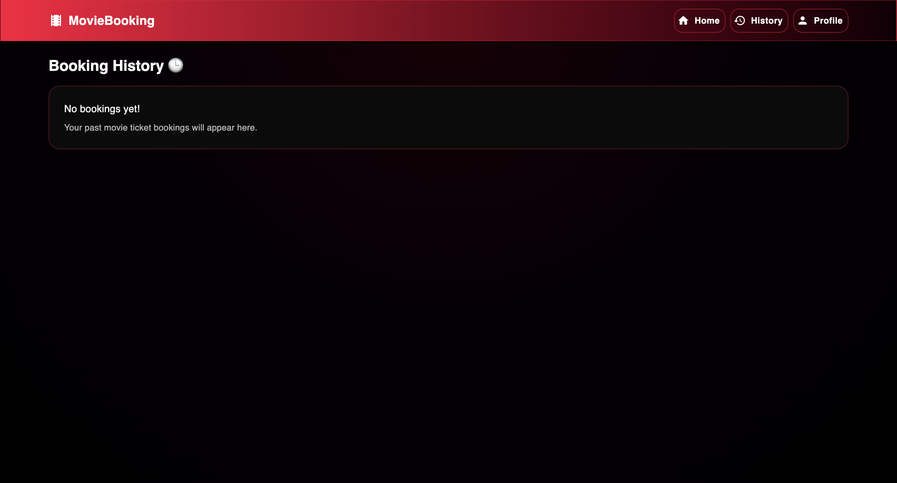
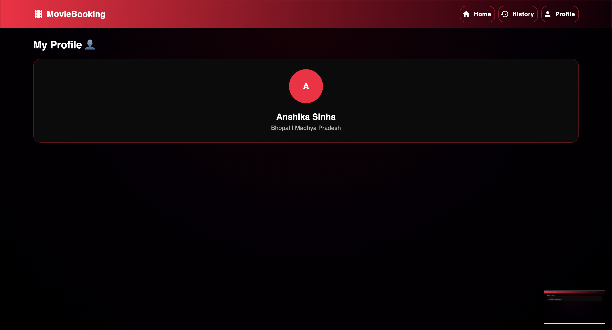

# 🎬 Movie Booking SPA

A **responsive Single Page Application (SPA)** for browsing movies and booking tickets.  
Built using **React + Bootstrap + Material UI**.

---

## ✨ Features

- Responsive UI (Mobile / Tablet / Desktop)  
- Movie listing with posters, rating, duration & price  
- Search movies by name  
- Filter movies by genre  
- Movie details page  
- Seat selection page  
- Booking summary & confirmation  
- Profile and History pages  
- Smooth navigation using React Router

---

## 🛠 Tech Stack

- **React JS**
- **Bootstrap**
- **Material UI (MUI)**
- **React Router DOM**
- **Custom CSS Theme (Red/Black)**

---

## 📸 Project Overview


### 🏠 Home Page


### 🎥 Movie Details Page


### 🍿 Seat Selection Page


### 🧾 Booking Summary Page


### 🎉 Booking Confirmation Page


### 🕒 Booking History Page


### 👤 Profile Page


---

## 📁 Project Structure

```bash
Movie-Booking-SPA/
│── public/
│── src/
│   │── assets/
│   │── components/
│   │   ├── Navbar.jsx
│   │   ├── MovieCard.jsx
│   │
│   │── pages/
│   │   ├── Home.jsx
│   │   ├── MovieDetails.jsx
│   │   ├── SeatSelection.jsx
│   │   ├── BookingSummary.jsx
│   │   ├── Confirmation.jsx
│   │   ├── History.jsx
│   │   ├── Profile.jsx
│   │
│   │── data/
│   │   └── movies.js
│   │
│   │── styles/
│   │   └── theme.css
│   │
│   │── App.js
│   │── index.js
│── package.json
│── README.md

---

